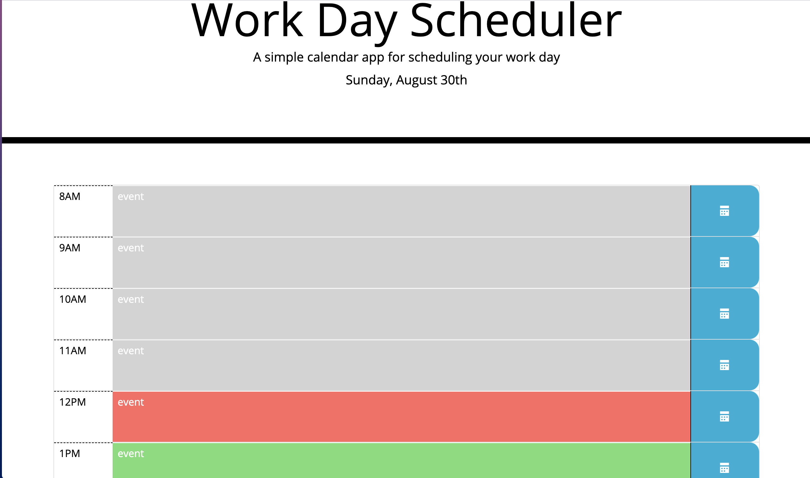

# Work Day Scheduler

## Features working
* When the user logs on to the page the user sees a daily schedule
* Today's date is featured at the top of the page
* When the user clicks on the event for the proper time, the user is presented with a textarea where the user can input an appointment. 
* When the user clicks the save button the appointment is pushed to localStorage

## Features not working 
* Change the class for the background color of the individual appointments based on whether the appointment is in the past, present or future
* Append the values in local storage to the html for the appropriate event

## Third Party APIs used:

* Bootstrap
* Momentjs
* Jquery
* JqueryUI